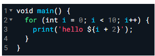
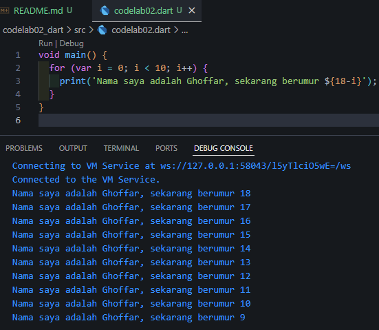
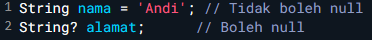
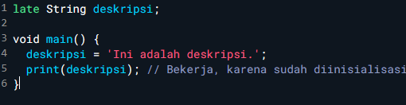

## CODELAB 02

### Soal 1: Modifikasilah kode pada baris 3 di VS Code atau Editor Code favorit Anda berikut ini agar mendapatkan keluaran (output) sesuai yang diminta!

#### Modifikasi code dan Output yang diminta

### Soal 2: Mengapa sangat penting untuk memahami bahasa pemrograman Dart sebelum kita menggunakan framework Flutter ? Jelaskan!

*Jawaban: Karena kita perlu memahami terlebih dahulu dasar-dasar dari penggunaan bahasa pemrograman Dart tersebut, setelah memahami dasar-dasarnya maka penggunaan framework flutter akan menjadi mudah*

### Soal 3: Rangkumlah materi dari codelab ini menjadi poin-poin penting yang dapat Anda gunakan untuk membantu proses pengembangan aplikasi mobile menggunakan framework Flutter.

*Jawaban:*
- *Dart adalah Wajib untuk Flutter: Dart adalah bahasa pemrograman yang digunakan untuk membangun aplikasi Flutter.*

- *Berbasis Objek (OOP): Semua di Dart adalah objek. Pahami konsep class dan object.*

- *Sintaks Familiar: Mirip dengan bahasa C, Java, atau JavaScript, sehingga mudah dipelajari.*

- *main() adalah Titik Awal: Setiap program Dart dimulai dari fungsi main().*

- *Fitur Unggulan untuk Development:*

    - *Hot Reload (JIT): Mempercepat proses coding dengan melihat perubahan secara instan.*

    - *Performa Cepat (AOT): Membuat aplikasi rilis menjadi lebih cepat dan lancar.*

### Soal 4: Buatlah penjelasan dan contoh eksekusi kode tentang perbedaan Null Safety dan Late variabel !

*Jawaban:*
- *Null safety mencegah variabel bernilai null secara tidak sengaja. Secara default, variabel tidak boleh null. Untuk mengizinkan null, gunakan tanda tanya ?.*
##### Contoh:

- *late menunda inisialisasi variabel. Anda memberitahu Dart bahwa variabel akan diberi nilai nanti, sebelum digunakan.*
##### Contoh:
