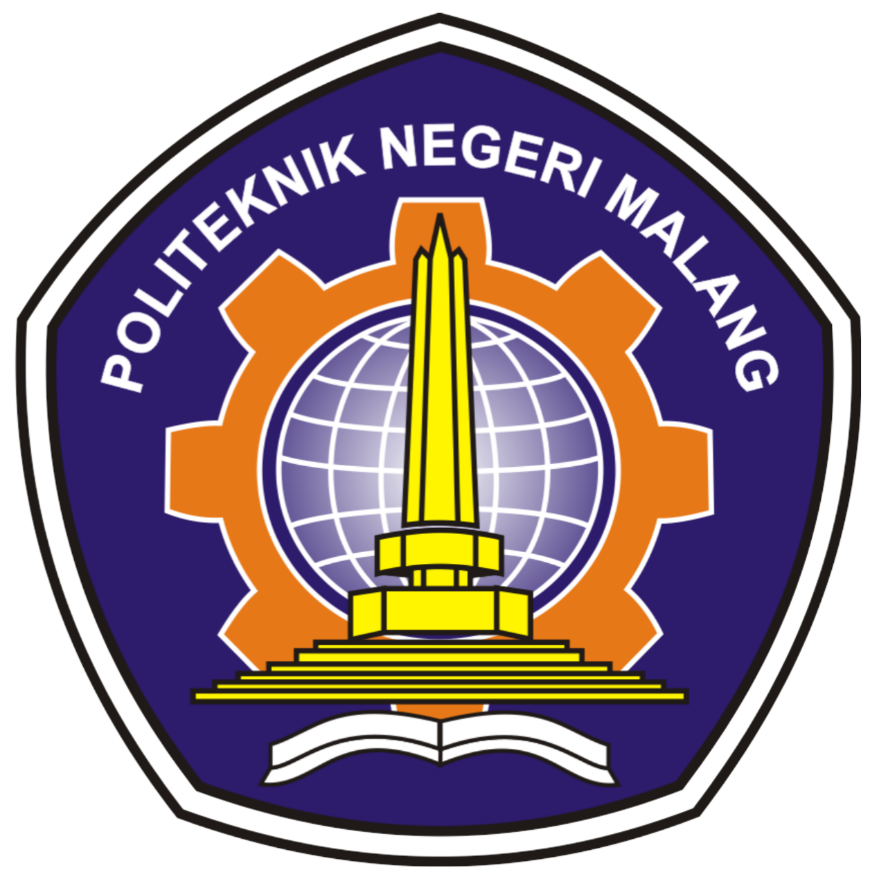

<p align="center"><strong>LAPORAN PRAKTIKUM MOBILE WEEK 6</strong></p>

<br><br>

<p align="center">
    
</p>

<div align="center">
  <table>
      <tr>
          <td><strong>Nama</strong></td>
          <td>: Ghoffar Abdul Ja'far</td>
      </tr>
      <tr>
          <td><strong>No Absen</strong></td>
          <td>: 16</td>
      </tr>
      <tr>
          <td><strong>NIM</strong></td>
          <td>: 2341720035</td>
      </tr>
      <tr>
          <td><strong>Prodi</strong></td>
          <td>: TEKNIK INFORMATIKA</td>
      </tr>
      <tr>
          <td><strong>Kelas</strong></td>
          <td>: 3H</td>
      </tr>
  </table>
</div>

# Praktikum 1: Membangun Layout di Flutter
### Code
```
import 'package:flutter/material.dart';

void main() => runApp(const MyApp());

class MyApp extends StatelessWidget {
  const MyApp({super.key});

  @override
  Widget build(BuildContext context) {
    Widget titleSection = Container(
      padding: const EdgeInsets.all(32), // padding di sepanjang tepi
      child: Row(
        children: [
          Expanded(
            // 🧠 Soal 1: Column di dalam Expanded agar menyesuaikan ruang
            child: Column(
              crossAxisAlignment: CrossAxisAlignment.start, // posisi kiri
              children: [
                // 🧠 Soal 2: Judul utama
                Container(
                  padding: const EdgeInsets.only(bottom: 8), // jarak bawah 8px
                  child: const Text(
                    'Wisata Gunung di Batu',
                    style: TextStyle(fontWeight: FontWeight.bold),
                  ),
                ),
                // Subjudul dengan warna abu-abu
                const Text(
                  'Batu, Malang, Indonesia',
                  style: TextStyle(color: Colors.grey),
                ),
              ],
            ),
          ),
          // 🧠 Soal 3: Ikon bintang merah dan teks "41"
          const Icon(Icons.star, color: Colors.red),
          const Text('41'),
        ],
      ),
    );
    return MaterialApp(
      title: 'Flutter layout: Ghoffar Abdul J dan 2341720035 Anda',
      home: Scaffold(
        appBar: AppBar(title: const Text('Flutter layout demo')),
        body: Column(children: [titleSection]),
      ),
    );
  }
}
```
### Screenshot

#  Praktikum 2: Implementasi button row
### Code
```
import 'package:flutter/material.dart';

void main() => runApp(const MyApp());

class MyApp extends StatelessWidget {
  const MyApp({super.key});

  @override
  Widget build(BuildContext context) {
    Widget titleSection = Container(
      padding: const EdgeInsets.all(32), // padding di sepanjang tepi
      child: Row(
        children: [
          Expanded(
            // 🧠 Soal 1: Column di dalam Expanded agar menyesuaikan ruang
            child: Column(
              crossAxisAlignment: CrossAxisAlignment.start, // posisi kiri
              children: [
                // 🧠 Soal 2: Judul utama
                Container(
                  padding: const EdgeInsets.only(bottom: 8), // jarak bawah 8px
                  child: const Text(
                    'Wisata Gunung di Batu',
                    style: TextStyle(fontWeight: FontWeight.bold),
                  ),
                ),
                // Subjudul dengan warna abu-abu
                const Text(
                  'Batu, Malang, Indonesia',
                  style: TextStyle(color: Colors.grey),
                ),
              ],
            ),
          ),
          // 🧠 Soal 3: Ikon bintang merah dan teks "41"
          const Icon(Icons.star, color: Colors.red),
          const Text('41'),
        ],
      ),
    );

    Color color = Theme.of(context).primaryColor;

    Widget buttonSection = Row(
      mainAxisAlignment: MainAxisAlignment.spaceEvenly,
      children: [
        _buildButtonColumn(color, Icons.call, 'CALL'),
        _buildButtonColumn(color, Icons.near_me, 'ROUTE'),
        _buildButtonColumn(color, Icons.share, 'SHARE'),
      ],
    );

    return MaterialApp(
      title: 'Flutter layout: Ghoffar Abdul J dan 2341720035 Anda',
      home: Scaffold(
        appBar: AppBar(title: const Text('Flutter layout demo')),
        body: Column(
          children: [
            titleSection,
            buttonSection,]
          ),
      ),
    );
  }

  Column _buildButtonColumn(Color color, IconData icon, String label) {
    return Column(
      mainAxisSize: MainAxisSize.min,
      mainAxisAlignment: MainAxisAlignment.center,
      children: [
        Icon(icon, color: color),
        Container(
          margin: const EdgeInsets.only(top: 8),
          child: Text(
            label,
            style: TextStyle(
              fontSize: 12,
              fontWeight: FontWeight.w400,
              color: color,
            ),
          ),
        ),
      ],
    );
  }
}
```
### Screenshot

# Praktikum 3: Implementasi text section
### Code
```
import 'package:flutter/material.dart';

void main() => runApp(const MyApp());

class MyApp extends StatelessWidget {
  const MyApp({super.key});

  @override
  Widget build(BuildContext context) {
    Widget titleSection = Container(
      padding: const EdgeInsets.all(32), // padding di sepanjang tepi
      child: Row(
        children: [
          Expanded(
            // 🧠 Soal 1: Column di dalam Expanded agar menyesuaikan ruang
            child: Column(
              crossAxisAlignment: CrossAxisAlignment.start, // posisi kiri
              children: [
                // 🧠 Soal 2: Judul utama
                Container(
                  padding: const EdgeInsets.only(bottom: 8), // jarak bawah 8px
                  child: const Text(
                    'Wisata Gunung di Batu',
                    style: TextStyle(fontWeight: FontWeight.bold),
                  ),
                ),
                // Subjudul dengan warna abu-abu
                const Text(
                  'Batu, Malang, Indonesia',
                  style: TextStyle(color: Colors.grey),
                ),
              ],
            ),
          ),
          // 🧠 Soal 3: Ikon bintang merah dan teks "41"
          const Icon(Icons.star, color: Colors.red),
          const Text('41'),
        ],
      ),
    );

    Color color = Theme.of(context).primaryColor;

    Widget buttonSection = Row(
      mainAxisAlignment: MainAxisAlignment.spaceEvenly,
      children: [
        _buildButtonColumn(color, Icons.call, 'CALL'),
        _buildButtonColumn(color, Icons.near_me, 'ROUTE'),
        _buildButtonColumn(color, Icons.share, 'SHARE'),
      ],
    );

    Widget textSection = Container(
      padding: const EdgeInsets.all(32),
      child: const Text(
        'Lembah Indah di lereng Gunung Kawi, Malang, adalah destinasi wisata alam yang memadukan keindahan pegunungan dengan suasana pedesaan yang tenang.'
        'Kawasan ini terkenal dengan panorama hijau, udara sejuk, serta spot glamping dan camping yang nyaman untuk menikmati alam tanpa kehilangan kenyamanan modern.'
        'Pengunjung juga dapat menikmati aktivitas seperti trekking ringan, berfoto di taman bunga, atau sekadar bersantai di kafe dengan pemandangan lembah. '
        'Tempat ini menjadi pilihan ideal bagi wisatawan yang ingin melepas penat dan mencari ketenangan di tengah keindahan alam pegunungan Jawa Timur.\n\n'
        'Nama: Ghoffar Abdul J\n'
        'NIM: 2341720035',
        softWrap: true,
      ),
    );

    return MaterialApp(
      title: 'Flutter layout: Ghoffar Abdul J dan 2341720035 Anda',
      home: Scaffold(
        appBar: AppBar(title: const Text('Flutter layout demo')),
        body: Column(
          children: [
            titleSection, 
            buttonSection,
            textSection,
            ]
          ),
      ),
    );
  }

  Column _buildButtonColumn(Color color, IconData icon, String label) {
    return Column(
      mainAxisSize: MainAxisSize.min,
      mainAxisAlignment: MainAxisAlignment.center,
      children: [
        Icon(icon, color: color),
        Container(
          margin: const EdgeInsets.only(top: 8),
          child: Text(
            label,
            style: TextStyle(
              fontSize: 12,
              fontWeight: FontWeight.w400,
              color: color,
            ),
          ),
        ),
      ],
    );
  }
}
```
### Screenshot

# Praktikum 4: Implementasi image section
### Code
```
import 'package:flutter/material.dart';

void main() => runApp(const MyApp());

class MyApp extends StatelessWidget {
  const MyApp({super.key});

  @override
  Widget build(BuildContext context) {
    Widget titleSection = Container(
      padding: const EdgeInsets.all(32), // padding di sepanjang tepi
      child: Row(
        children: [
          Expanded(
            // 🧠 Soal 1: Column di dalam Expanded agar menyesuaikan ruang
            child: Column(
              crossAxisAlignment: CrossAxisAlignment.start, // posisi kiri
              children: [
                // 🧠 Soal 2: Judul utama
                Container(
                  padding: const EdgeInsets.only(bottom: 8), // jarak bawah 8px
                  child: const Text(
                    'Wisata Gunung di Batu',
                    style: TextStyle(fontWeight: FontWeight.bold),
                  ),
                ),
                // Subjudul dengan warna abu-abu
                const Text(
                  'Batu, Malang, Indonesia',
                  style: TextStyle(color: Colors.grey),
                ),
              ],
            ),
          ),
          // 🧠 Soal 3: Ikon bintang merah dan teks "41"
          const Icon(Icons.star, color: Colors.red),
          const Text('41'),
        ],
      ),
    );

    Color color = Theme.of(context).primaryColor;

    Widget buttonSection = Row(
      mainAxisAlignment: MainAxisAlignment.spaceEvenly,
      children: [
        _buildButtonColumn(color, Icons.call, 'CALL'),
        _buildButtonColumn(color, Icons.near_me, 'ROUTE'),
        _buildButtonColumn(color, Icons.share, 'SHARE'),
      ],
    );

    Widget textSection = Container(
      padding: const EdgeInsets.all(32),
      child: const Text(
        'Lembah Indah di lereng Gunung Kawi, Malang, adalah destinasi wisata alam yang memadukan keindahan pegunungan dengan suasana pedesaan yang tenang.'
        'Kawasan ini terkenal dengan panorama hijau, udara sejuk, serta spot glamping dan camping yang nyaman untuk menikmati alam tanpa kehilangan kenyamanan modern.'
        'Pengunjung juga dapat menikmati aktivitas seperti trekking ringan, berfoto di taman bunga, atau sekadar bersantai di kafe dengan pemandangan lembah. '
        'Tempat ini menjadi pilihan ideal bagi wisatawan yang ingin melepas penat dan mencari ketenangan di tengah keindahan alam pegunungan Jawa Timur.\n\n'
        'Nama: Ghoffar Abdul J\n'
        'NIM: 2341720035',
        softWrap: true,
      ),
    );

    return MaterialApp(
      title: 'Flutter layout: Ghoffar Abdul J dan 2341720035 Anda',
      home: Scaffold(
        appBar: AppBar(title: const Text('Flutter layout demo')),
        body: ListView(
          children: [
            Image.asset(
              'images/lembah.jpg',
              width: 600,
              height: 240,
              fit: BoxFit.cover,
            ),
            titleSection, 
            buttonSection,
            textSection,
            ]
          ),
      ),
    );
  }

  Column _buildButtonColumn(Color color, IconData icon, String label) {
    return Column(
      mainAxisSize: MainAxisSize.min,
      mainAxisAlignment: MainAxisAlignment.center,
      children: [
        Icon(icon, color: color),
        Container(
          margin: const EdgeInsets.only(top: 8),
          child: Text(
            label,
            style: TextStyle(
              fontSize: 12,
              fontWeight: FontWeight.w400,
              color: color,
            ),
          ),
        ),
      ],
    );
  }
}
```
### Screenshot

# Tugas Praktikum 1
### Code
```
import 'package:flutter/material.dart';

void main() {
  runApp(const MyApp());
}

class MyApp extends StatelessWidget {
  const MyApp({super.key});

  @override
  Widget build(BuildContext context) {
    return MaterialApp(
      title: 'Recipe App',
      debugShowCheckedModeBanner: false,
      home: Scaffold(
        appBar: AppBar(
          title: const Text('Recipe Layout'),
        ),
        body: const RecipeLayout(),
      ),
    );
  }
}

class RecipeLayout extends StatelessWidget {
  const RecipeLayout({super.key});

  @override
  Widget build(BuildContext context) {
    final isPortrait =
        MediaQuery.of(context).orientation == Orientation.portrait;

    return LayoutBuilder(
      builder: (context, constraints) {
        if (isPortrait) {
          // Mode portrait: kolom (gambar atas, teks bawah)
          return Column(
            children: [
              Expanded(
                flex: 2,
                child: Image.asset(
                  "img/pavlova.png",
                  width: double.infinity,
                  fit: BoxFit.cover,
                ),
              ),
              Expanded(
                flex: 3,
                child: SingleChildScrollView(
                  padding: const EdgeInsets.all(12),
                  child: buildTextContent(),
                ),
              ),
            ],
          );
        } else {
          // Mode landscape: row (teks kiri, gambar kanan)
          return Row(
            children: [
              Expanded(
                flex: 2,
                child: SingleChildScrollView(
                  padding: const EdgeInsets.all(12),
                  child: buildTextContent(),
                ),
              ),
              Expanded(
                flex: 3,
                child: Image.asset(
                  "img/pavlova.png",
                  fit: BoxFit.cover,
                  width: double.infinity,
                  height: double.infinity,
                ),
              ),
            ],
          );
        }
      },
    );
  }

  // Bagian teks biar rapi
  Widget buildTextContent() {
    return Column(
      crossAxisAlignment: CrossAxisAlignment.start,
      children: [
        const Text(
          "Mango Pavlova",
          style: TextStyle(
              fontWeight: FontWeight.bold, fontSize: 22, color: Colors.teal),
        ),
        const SizedBox(height: 8),
        const Text(
          "Pavlova is a meringue-based dessert named after the Russian ballerina Anna Pavlova. "
          "Pavlova features a crisp crust and soft, light inside, topped with fruit and whipped cream.",
          softWrap: true,
        ),
        const SizedBox(height: 12),
        Row(
          children: [
            Row(
              children: List.generate(
                5,
                (index) =>
                    const Icon(Icons.star, color: Colors.red, size: 18),
              ),
            ),
            const SizedBox(width: 8),
            const Text(
              "170 Reviews",
              style: TextStyle(color: Colors.grey),
            ),
          ],
        ),
        const SizedBox(height: 16),
        Row(
          mainAxisAlignment: MainAxisAlignment.spaceEvenly,
          children: const [
            InfoColumn(icon: Icons.schedule, label: "PREP:", value: "25 min"),
            InfoColumn(icon: Icons.restaurant, label: "COOK:", value: "1 hr"),
            InfoColumn(icon: Icons.people, label: "FEEDS:", value: "4-6"),
          ],
        )
      ],
    );
  }
}

class InfoColumn extends StatelessWidget {
  final IconData icon;
  final String label;
  final String value;

  const InfoColumn(
      {super.key, required this.icon, required this.label, required this.value});

  @override
  Widget build(BuildContext context) {
    return Column(
      children: [
        Icon(icon, color: Colors.green),
        const SizedBox(height: 4),
        Text(label, style: const TextStyle(fontWeight: FontWeight.bold)),
        Text(value),
      ],
    );
  }
}
```
### Screenshot


# Praktikum 5: Membangun Navigasi di Flutter
### Screenshot


# Tugas Praktikum 2
### Screenshot

