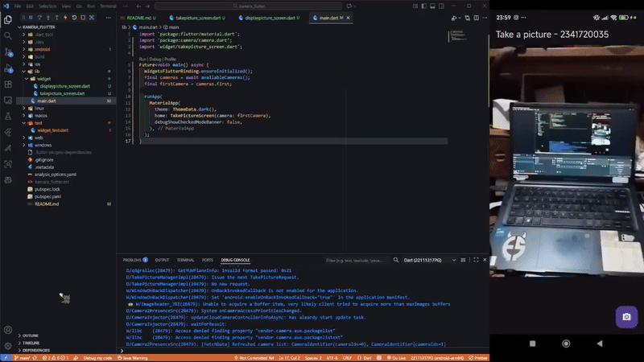

<p align="center"><strong>LAPORAN PRAKTIKUM MOBILE WEEK 9</strong></p>

<br><br>

<p align="center">
    
</p>

<div align="center">
  <table>
      <tr>
          <td><strong>Nama</strong></td>
          <td>: Ghoffar Abdul Ja'far</td>
      </tr>
      <tr>
          <td><strong>No Absen</strong></td>
          <td>: 16</td>
      </tr>
      <tr>
          <td><strong>NIM</strong></td>
          <td>: 2341720035</td>
      </tr>
      <tr>
          <td><strong>Prodi</strong></td>
          <td>: TEKNIK INFORMATIKA</td>
      </tr>
      <tr>
          <td><strong>Kelas</strong></td>
          <td>: 3H</td>
      </tr>
  </table>
</div>

# Praktikum 
## Praktikum1 
### Langkah 1:
### import:
```
flutter pub add camera path_provider path
```
### lib/main.dart:
```
import 'package:flutter/material.dart';
import 'package:camera/camera.dart';
import 'widget/takepicture_screen.dart';

Future<void> main() async {
  WidgetsFlutterBinding.ensureInitialized();
  final cameras = await availableCameras();
  final firstCamera = cameras.first;

  runApp(
    MaterialApp(
      theme: ThemeData.dark(),
      home: TakePictureScreen(camera: firstCamera),
      debugShowCheckedModeBanner: false,
    ),
  );
}
```
### lib/widget/takepicture_screen.dart:
```
import 'package:camera/camera.dart';
import 'package:flutter/material.dart';
import 'displaypicture_screen.dart';

// A screen that allows users to take a picture using a given camera.
class TakePictureScreen extends StatefulWidget {
  const TakePictureScreen({super.key, required this.camera});

  final CameraDescription camera;

  @override
  TakePictureScreenState createState() => TakePictureScreenState();
}

class TakePictureScreenState extends State<TakePictureScreen> {
  late CameraController _controller;
  late Future<void> _initializeControllerFuture;

  @override
  void initState() {
    super.initState();
    // To display the current output from the Camera,
    // create a CameraController.
    _controller = CameraController(
      // Get a specific camera from the list of available cameras.
      widget.camera,
      // Define the resolution to use.
      ResolutionPreset.medium,
    );

    // Next, initialize the controller. This returns a Future.
    _initializeControllerFuture = _controller.initialize();
  }

  @override
  void dispose() {
    // Dispose of the controller when the widget is disposed.
    _controller.dispose();
    super.dispose();
  }

  @override
  Widget build(BuildContext context) {
    return Scaffold(
      appBar: AppBar(title: const Text('Take a picture - 2341720035')),
      // You must wait until the controller is initialized before displaying the
      // camera preview. Use a FutureBuilder to display a loading spinner until the
      // controller has finished initializing.
      body: FutureBuilder<void>(
        future: _initializeControllerFuture,
        builder: (context, snapshot) {
          if (snapshot.connectionState == ConnectionState.done) {
            // If the Future is complete, display the preview.
            return CameraPreview(_controller);
          } else {
            // Otherwise, display a loading indicator.
            return const Center(child: CircularProgressIndicator());
          }
        },
      ),
      floatingActionButton: FloatingActionButton(
        onPressed: () async {
          try {
            await _initializeControllerFuture;
            final image = await _controller.takePicture();

            if (!context.mounted) return;

            await Navigator.of(context).push(
              MaterialPageRoute(
                builder: (context) =>
                    DisplayPictureScreen(imagePath: image.path),
              ),
            );
          } catch (e) {
            print(e);
          }
        },
        child: const Icon(Icons.camera_alt),
      ),
    );
  }
}
```
### displaypicture_screen.dart:
```
import 'package:flutter/material.dart';
import 'dart:io';

// A widget that displays the picture taken by the user.
class DisplayPictureScreen extends StatelessWidget {
  final String imagePath;

  const DisplayPictureScreen({super.key, required this.imagePath});

  @override
  Widget build(BuildContext context) {
    return Scaffold(
      appBar: AppBar(title: const Text('Display the Picture - 2341720035')),
      // The image is stored as a file on the device. Use the `Image.file`
      // constructor with the given path to display the image.
      body: Image.file(File(imagePath)),
    );
  }
}
```
**Screnshot Hasil**


## Praktikum2
### Langkah import:
```
flutter pub add camera path_provider path
```
### Langkah lib/main.dart:
```
import 'package:flutter/material.dart';
import 'package:camera/camera.dart';
import 'widget/takepicture_screen.dart';

Future<void> main() async {
  // Langkah 3: Pastikan binding Flutter sudah diinisialisasi
  WidgetsFlutterBinding.ensureInitialized();

  // Ambil daftar kamera yang tersedia di device
  final cameras = await availableCameras();

  // Pilih kamera pertama (biasanya kamera belakang)
  final firstCamera = cameras.first;

  // Jalankan aplikasi utama
  runApp(
    MaterialApp(
      debugShowCheckedModeBanner: false,
      theme: ThemeData.dark(),
      home: TakePictureScreen(
        camera: firstCamera,
      ),
    ),
  );
}  
```
### Langkah 3:
```

```
### Langkah 4:
```

```
### Langkah 5:
```

```
### Langkah 6:
```

```
**Screnshot Hasil**


# Tugas Praktikum
1. Jelaskan maksud dari langkah 2 pada praktikum tersebut!
- **Jawaban:** Langkah 2 bertujuan untuk menambahkan plugin eksternal auto_size_text ke dalam project Flutter agar bisa digunakan untuk menampilkan teks yang otomatis menyesuaikan ukuran.

2. Jelaskan maksud dari langkah 5 pada praktikum tersebut!
- **Jawaban:** Langkah 5 bertujuan untuk menambahkan variabel text agar widget AutoSizeText bisa menampilkan isi teks yang dikirim melalui constructor.

3. Pada langkah 6 terdapat dua widget yang ditambahkan, jelaskan fungsi dan perbedaannya!
- **Jawaban:** Widget RedTextWidget menampilkan teks yang otomatis menyesuaikan ukuran agar muat di ruang sempit, sedangkan Text menampilkan teks dengan ukuran tetap yang bisa terpotong jika ruangnya terbatas.

4. Jelaskan maksud dari tiap parameter yang ada di dalam plugin auto_size_text
- **Jawaban:** Plugin auto_size_text memiliki beberapa parameter penting yang membantu teks menyesuaikan ukuran agar muat di ruang yang tersedia. Parameter maxLines membatasi jumlah baris teks, sedangkan minFontSize dan maxFontSize menentukan batas ukuran huruf terkecil dan terbesar. stepGranularity mengatur seberapa besar penurunan ukuran huruf tiap langkah, dan presetFontSizes memungkinkan kita menentukan ukuran huruf yang diizinkan secara spesifik. Jika teks tetap tidak muat, overflowReplacement bisa digunakan untuk menampilkan widget pengganti agar tampilan tetap rapi dan terbaca.
