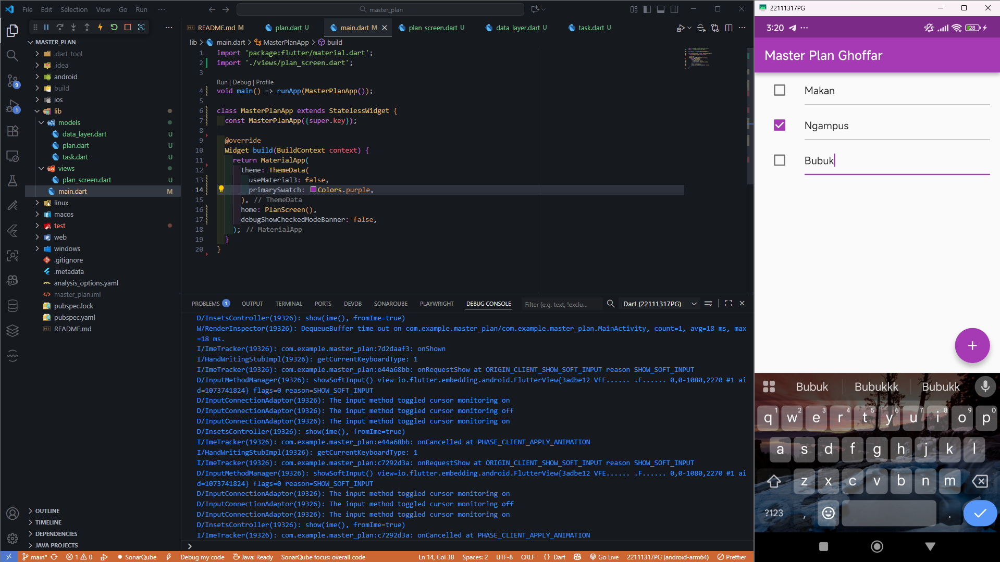
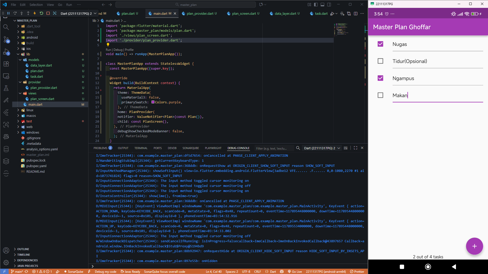
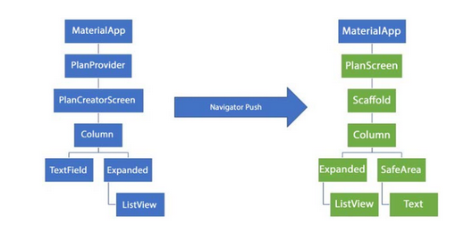

<strong>LAPORAN PRAKTIKUM MOBILE WEEK 10</strong>

  

    

  <table>
      <tr>
          <td><strong>Nama</strong></td>
          <td>: Ghoffar Abdul Ja'far</td>
      </tr>
      <tr>
          <td><strong>No Absen</strong></td>
          <td>: 16</td>
      </tr>
      <tr>
          <td><strong>NIM</strong></td>
          <td>: 2341720035</td>
      </tr>
      <tr>
          <td><strong>Prodi</strong></td>
          <td>: TEKNIK INFORMATIKA</td>
      </tr>
      <tr>
          <td><strong>Kelas</strong></td>
          <td>: 3H</td>
      </tr>
  </table>

# Praktikum
## Praktikum 1
**Hasil**

## Praktikum 2
**Hasil**

## Praktikum 3
**Hasil**

# Tugas
## Tugas 1
1. Jelaskan maksud dari langkah 4 pada praktikum tersebut! Mengapa dilakukan demikian?
- **Jawaban:** Langkah 4 bertujuan menyatukan ekspor model agar impor di file lain lebih ringkas dan terstruktur.
2. Mengapa perlu variabel plan di langkah 6 pada praktikum tersebut? Mengapa dibuat konstanta ?
- **Jawaban:** Variabel plan di langkah 6 digunakan untuk menyimpan data rencana tugas secara global dalam state, dibuat konstanta agar nilainya awalnya tetap dan mudah diinisialisasi.
3. Lakukan capture hasil dari Langkah 9 berupa GIF, kemudian jelaskan apa yang telah Anda buat!
- **Jawaban:** membuat aplikasi todo list

4. Apa kegunaan method pada Langkah 11 dan 13 dalam lifecyle state ?
- **Jawaban:** Method pada langkah 11 dan 13 berfungsi mengatur siklus hidup state: initState() untuk inisialisasi awal, sedangkan dispose() untuk membersihkan resource saat widget dihapus.

## Tugas 2
1. Jelaskan mana yang dimaksud InheritedWidget pada langkah 1 tersebut! Mengapa yang digunakan InheritedNotifier?
- **Jawaban:** InheritedWidget yang dimaksud adalah PlanProvider, digunakan dengan InheritedNotifier agar widget dapat mendengarkan perubahan data secara otomatis.
2. Jelaskan maksud dari method di langkah 3 pada praktikum tersebut! Mengapa dilakukan demikian?
- **Jawaban:** Method tersebut berfungsi menghitung jumlah tugas selesai dan menampilkan pesan progres, dilakukan agar UI dapat menampilkan status penyelesaian secara dinamis.

## Tugas 3 
1. Berdasarkan Praktikum 3 yang telah Anda lakukan, jelaskan maksud dari gambar diagram berikut ini!

- **Jawaban:** Diagram tersebut menunjukkan proses perpindahan layar menggunakan Navigator.push, di mana aplikasi berpindah dari PlanCreatorScreen ke PlanScreen. Perpindahan ini membuat pohon widget baru untuk menampilkan daftar rencana tanpa menghapus layar sebelumnya, sehingga data tetap terjaga dan pengguna dapat kembali ke layar awal.