<p align="center"><strong>LAPORAN PRAKTIKUM MOBILE WEEK 11</strong></p>

<br><br>

<p align="center">
    
</p>

<div align="center">
  <table>
      <tr>
          <td><strong>Nama</strong></td>
          <td>: Ghoffar Abdul Ja'far</td>
      </tr>
      <tr>
          <td><strong>No Absen</strong></td>
          <td>: 16</td>
      </tr>
      <tr>
          <td><strong>NIM</strong></td>
          <td>: 2341720035</td>
      </tr>
      <tr>
          <td><strong>Prodi</strong></td>
          <td>: TEKNIK INFORMATIKA</td>
      </tr>
      <tr>
          <td><strong>Kelas</strong></td>
          <td>: 3H</td>
      </tr>
  </table>
</div>

# Tugas
## Soal 1
- **Tambahkan nama panggilan Anda pada title app sebagai identitas hasil pekerjaan Anda.**
```
class _FuturePageState extends State<FuturePage> {
  String result = '';

  @override
  Widget build(BuildContext context) {
    return Scaffold(
      appBar: AppBar(title: const Text('Back from the future - Ghoffar')),
      body: Center(
        child: Column(
          children: [
            const Spacer(),
            ElevatedButton(
              child: const Text('GO!'),
              onPressed: () {
                setState(() {});
                getData().then((value) {
                  result = value.body.toString().substring(0, 450);
                  setState(() {});
                }).catchError((_) {
                  result = 'An error occurred';
                  setState(() {});
                });
              },
            ),
            const Spacer(),
            Text(result),
            const Spacer(),
            const CircularProgressIndicator(),
            const Spacer(),
          ],
        ),
      ),
    );
  }
```
## Soal 2
- **Carilah judul buku favorit Anda di Google Books, lalu ganti ID buku pada variabel path di kode tersebut. Caranya ambil di URL browser Anda seperti gambar berikut ini.**
```
Future<Response> getData() async {
    const authority = 'www.googleapis.com';
    const path = '/books/v1/volumes/hfwEEAAAQBAJ';
    Uri url = Uri.https(authority, path);
    return http.get(url);
  }
```
- **Kemudian cobalah akses di browser URI tersebut dengan lengkap seperti ini. Jika menampilkan data JSON, maka Anda telah berhasil. Lakukan capture milik Anda dan tulis di README pada laporan praktikum. Lalu lakukan commit dengan pesan "W11: Soal 2".**
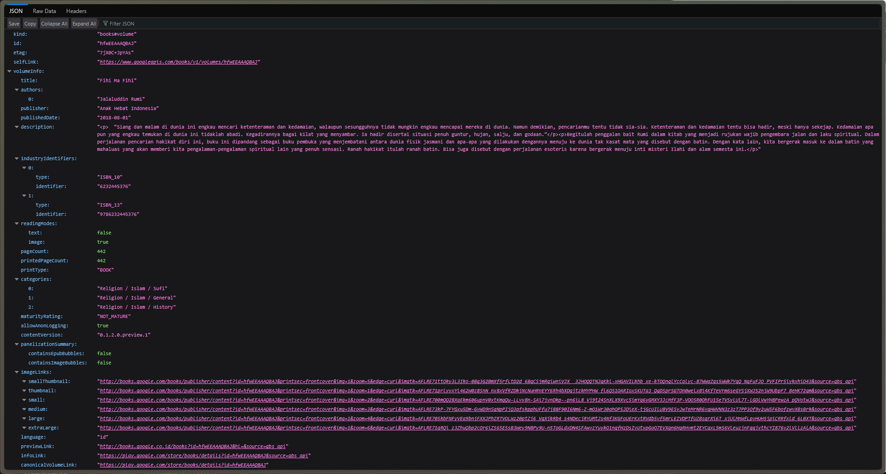

## Soal3
- **Jelaskan maksud kode langkah 5 tersebut terkait substring dan catchError!**
**Jawaban:** Kode tersebut memanggil fungsi asinkron getData() dan menggunakan .then() untuk mengakses response body lalu mencetak 100 karakter pertama (substring) ke konsol jika berhasil, sementara .catchError() berfungsi sebagai mekanisme penanganan exception asinkron yang dilempar jika permintaan gagal (misalnya, masalah koneksi atau status HTTP non-200).
- **Hasil**
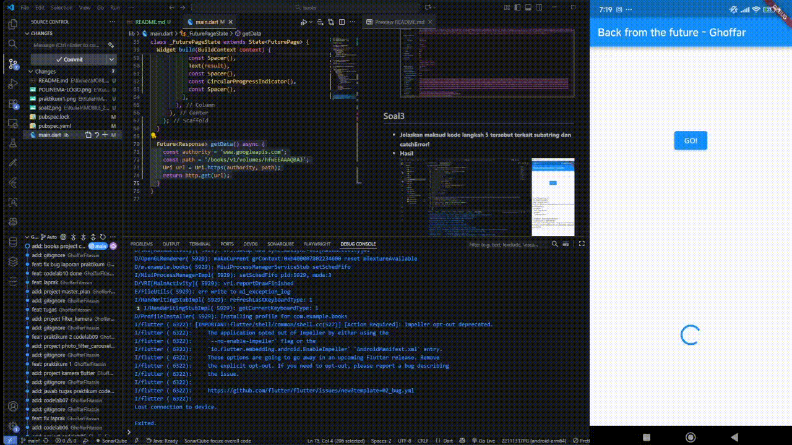

## Soal4
- **Jelaskan maksud kode langkah 1 dan 2 tersebut!**
**Jawaban:** Kode Langkah 1 mendefinisikan tiga fungsi asinkron yang masing-masing menggunakan await Future.delayed untuk mensimulasikan penundaan 3 detik, dan Kode Langkah 2 menggunakan await secara berurutan pada ketiga fungsi tersebut, sehingga menghasilkan total waktu eksekusi sekuensial selama 9 detik untuk menghitung totalnya. 
- **Hasil**


## Soal 5
- **Jelaskan maksud kode langkah 2 tersebut!**
**Jawaban:** Kode tersebut menggunakan Completer sebagai promise yang dapat diselesaikan di masa depan, di mana getNumber() segera mengembalikan objek completer.future ke pemanggil, sementara calculate() menunda selama 5 detik sebelum secara manual memanggil completer.complete(42) untuk menyelesaikan Future dengan nilai 42.
- **Hasil**
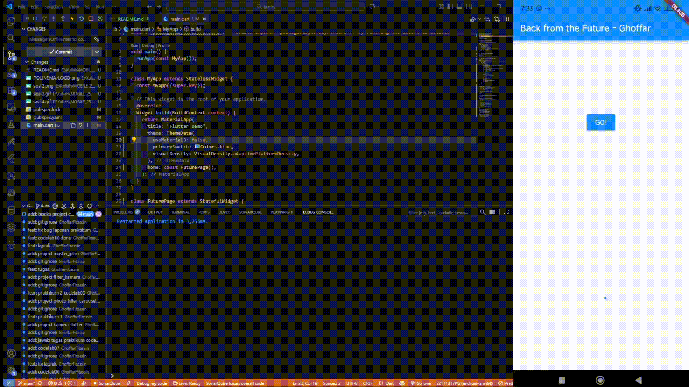

## Soal 6
- **Jelaskan maksud perbedaan kode langkah 2 dengan langkah 5-6 tersebut!**
**Jawaban:** Perbedaan utamanya adalah bahwa Kode Langkah 2 menggunakan completer.complete(42) untuk menyelesaikan Future secara sukses, sedangkan Kode Langkah 5 menggantinya dengan completer.completeError() untuk menyelesaikan Future dengan error, yang kemudian ditangkap dan ditangani oleh metode catchError di Langkah 6.
- **Hasil**
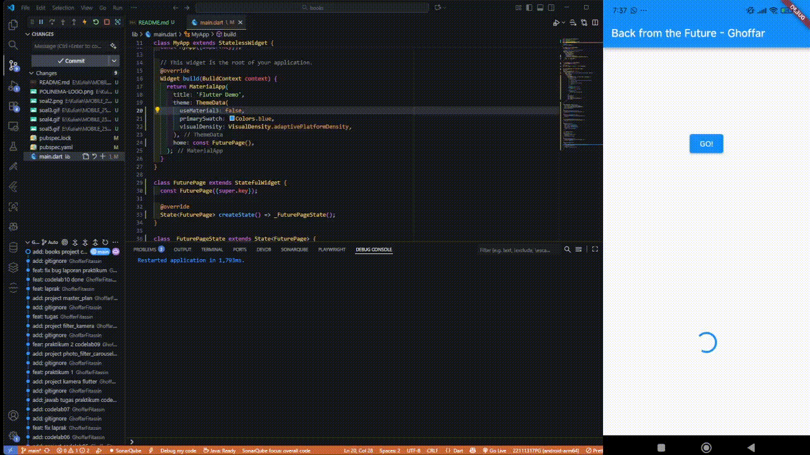

## Soal 7
- **Hasil**
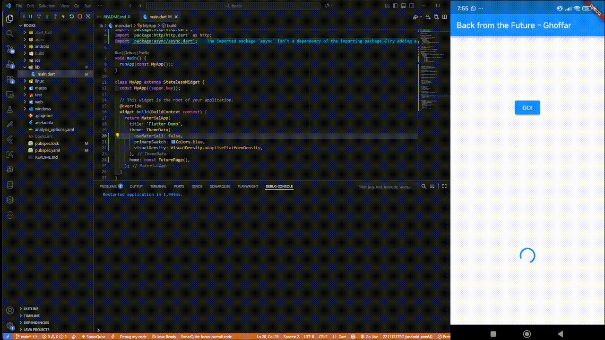

## Soal 8
- **Jelaskan maksud perbedaan kode langkah 1 dan 4!**
**Jawaba:** Maksud perbedaannya adalah bahwa meskipun keduanya bertujuan untuk menjalankan Future secara paralel dan mengembalikan hasil dalam bentuk List, Future.wait (Langkah 4) adalah fungsi bawaan (dart:async) yang sederhana dan idiomatik untuk menunggu sekumpulan Future yang telah dibuat, sementara FutureGroup (Langkah 1, dari package:async) adalah kelas yang lebih kompleks yang memungkinkan penambahan Future secara dinamis setelah group dibuat, tetapi keduanya mencapai hasil fungsional yang sama dalam skenario ini.

## Soal 9
- **Hasil**
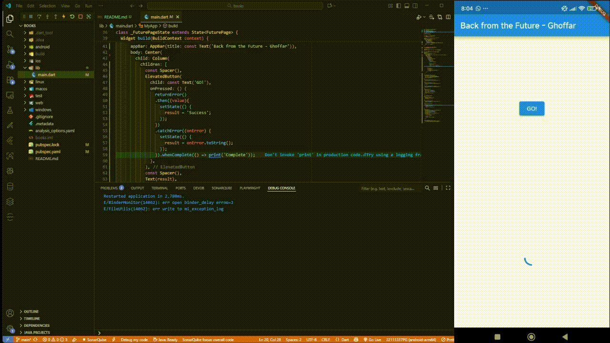

## Soal 10
- **Panggil method handleError() tersebut di ElevatedButton, lalu run. Apa hasilnya? Jelaskan perbedaan kode langkah 1 dan 4!**
**Jawaban**
Secara konseptual hasilnya sama, namun perbedaannya adalah:

- Struktur penulisan: .then().catchError() menggunakan method chaining, sedangkan async/await menggunakan alur imperatif yang lebih linear dan mudah dibaca.
- Penanganan error: .catchError() menangani error pada Future, sementara try/catch menangani error dengan gaya seperti synchronous code.
- Finally / completion: .whenComplete() selalu dijalankan setelah Future selesai di chaining, sedangkan finally dijalankan setelah blok try/catch selesai.
- Keterbacaan untuk banyak Future: async/await lebih mudah dibaca dan dikelola jika ada banyak Future, sementara chaining .then() bisa cepat membingungkan jika kompleks.

## Soal 11
```
Widget build(BuildContext context) {
    return Scaffold(
      appBar: AppBar(
        title: const Text('Current Location - Ghoffar'),
      ),
      body: Center(
        child: Text(myPosition),
      ),
    );
  }
```

## Soal 12
- **Apakah Anda mendapatkan koordinat GPS ketika run di browser? Mengapa demikian?**
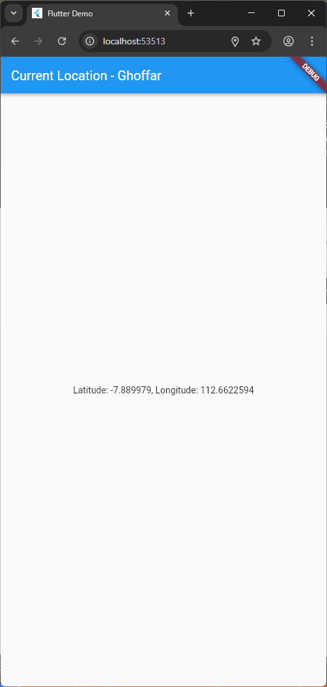
**Jawaban:** Tetap bisa jalan di browser. hal tersebut karena AndroidManifest.xml hanya berlaku untuk platform Android, sedangkan kalau kamu run Flutter di browser (Flutter Web), maka yang digunakan adalah API lokasi milik browser, bukan Android permission system.
- **Hasil**
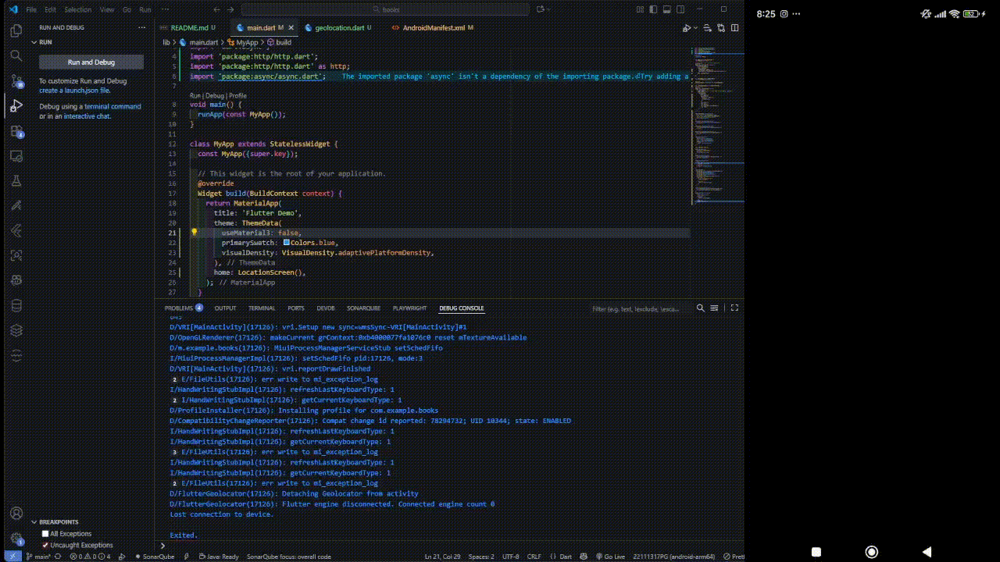

## Soal 13
- **Apakah ada perbedaan UI dengan praktikum sebelumnya? Mengapa demikian?**
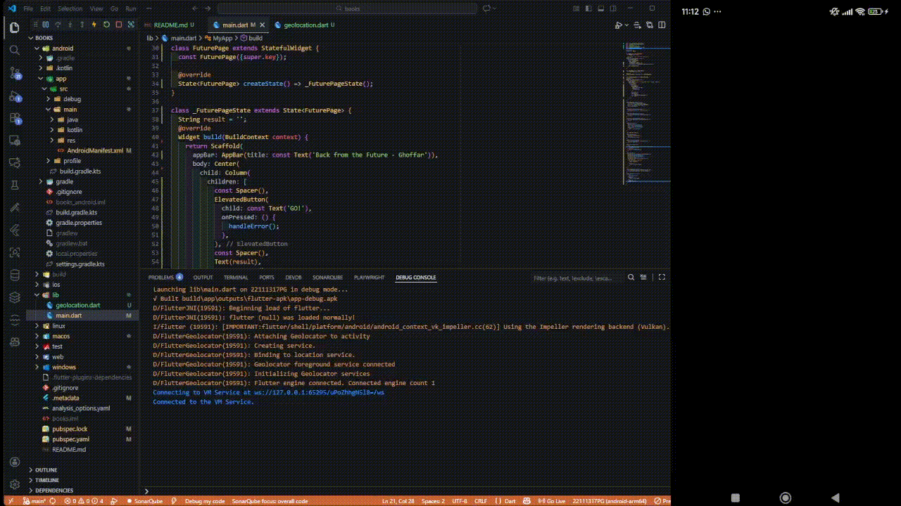
**Jawaban:** Versi kode Geolocation saat ini, yang menggunakan FutureBuilder, secara otomatis mengelola status asinkron (loading/done/error) dan pembaruan UI tanpa memerlukan setState() manual atau variabel state tambahan, berbeda dengan versi sebelumnya yang menggunakan pola async/await dan setState() yang membutuhkan developer untuk mengendalikan lifecycle pembaruan tampilan secara eksplisit.

## Soal 14
- **Apakah ada perbedaan UI dengan praktikum sebelumnya? Mengapa demikian?**
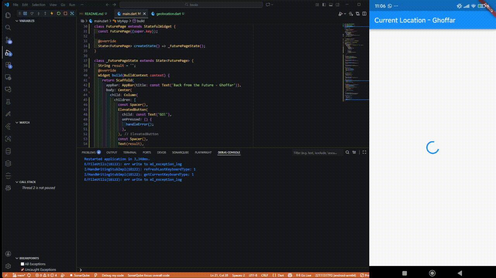
**Jawaban:** Perbedaan utama antara kode awal sebelum ada tambahan error handling dan versi yang sekarang ini ada pada penanganan hasil Future di bagian FutureBuilder, bukan pada cara pengambilan lokasinya.

Pada versi awal, kode hanya menampilkan hasil ketika connectionState == done tanpa memeriksa apakah Future menghasilkan data valid atau error — jadi kalau terjadi error (misalnya user menolak izin lokasi atau layanan lokasi dimatikan), aplikasi bisa menampilkan null atau bahkan error di konsol tanpa pesan ke pengguna.

## Soal 15
```
@override
  Widget build(BuildContext context) {
    return Scaffold(
      backgroundColor: color,
      appBar: AppBar(title: const Text('Navigation First - Ghoffar')),
      body: Center(
        child: ElevatedButton(
          child: const Text('Change Color'),
          onPressed: () {
            _navigateAndGetColor(context);
          },
        ),
      ),
    );
  }
```

## Soal 16
Setelah menekan tombol 'Change Color', kita akan diarahkan ke Navigation Second dimana kita diberi pilihan untuk mengganti background merah, hijau, dan biru.
**Hasil**
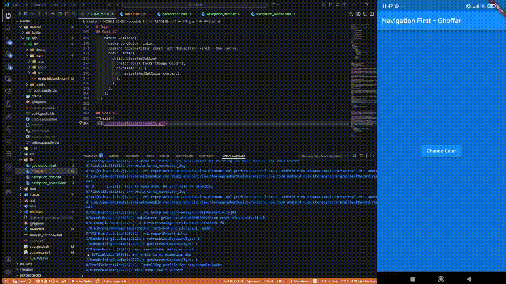

## Soal 17
Setiap kali di klik 'change color', maka akan muncul pop ut yang menanyakan warna yang dipilih. Jika sudah, maka akan diterpkan ke background. Hal tersebut terjadi karena kita menggunakan file baru navigation dialog untuk melakukan hal tersebut.
**Hasil**
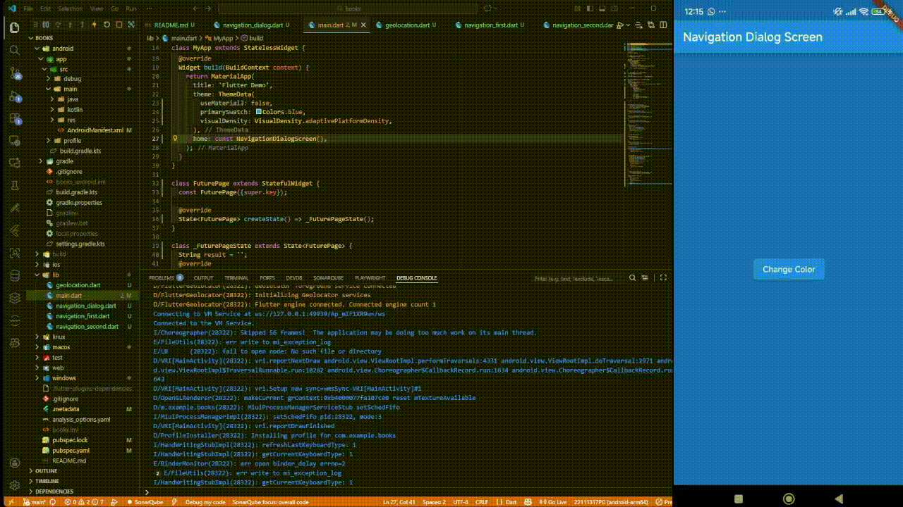