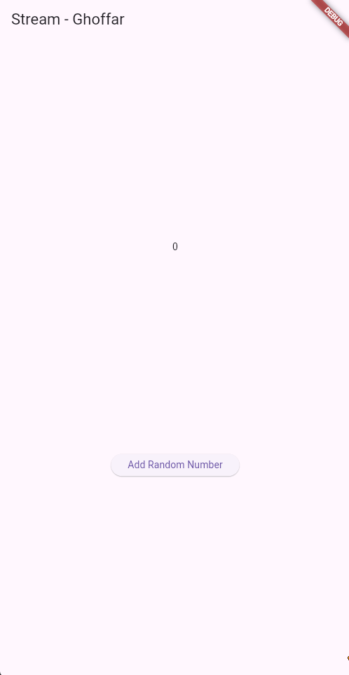
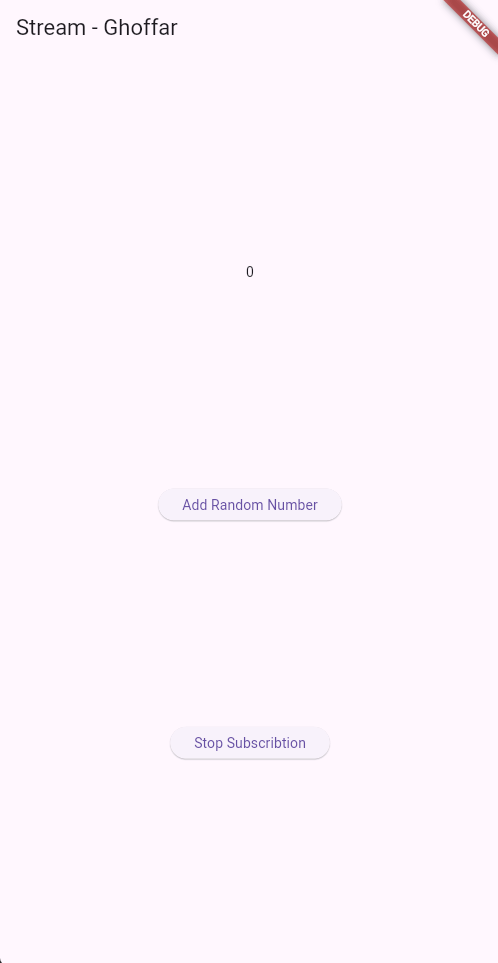

<p align="center"><strong>LAPORAN PRAKTIKUM MOBILE WEEK 12</strong></p>

<br><br>

<p align="center">
    
</p>

<div align="center">
  <table>
      <tr>
          <td><strong>Nama</strong></td>
          <td>: Ghoffar Abdul Ja'far</td>
      </tr>
      <tr>
          <td><strong>No Absen</strong></td>
          <td>: 16</td>
      </tr>
      <tr>
          <td><strong>NIM</strong></td>
          <td>: 2341720035</td>
      </tr>
      <tr>
          <td><strong>Prodi</strong></td>
          <td>: TEKNIK INFORMATIKA</td>
      </tr>
      <tr>
          <td><strong>Kelas</strong></td>
          <td>: 3H</td>
      </tr>
  </table>
</div>

# Tugas
## Soal 1
**Tambahkan nama panggilan Anda pada title app sebagai identitas hasil pekerjaan Anda. Gantilah warna tema aplikasi sesuai kesukaan Anda.**
```
@override
  Widget build(BuildContext context) {
    return MaterialApp(
      title: 'Stream - Ghoffar',
      theme: ThemeData(primarySwatch: Colors.purple),
      home: const StreamHomePage(),
    );
  }
```
## Soal 2
**Tambahkan 5 warna lainnya sesuai keinginan Anda pada variabel colors tersebut.**
```
  Colors.indigo,
  Colors.pink,
  Colors.orange,
  Colors.green,
  Colors.red
```

## Soal 3
**Jelaskan fungsi keyword yield* pada kode tersebut! Apa maksud isi perintah kode tersebut?**

**Jawaban:** yield* digunakan untuk meneruskan semua data yang dihasilkan oleh Stream.periodic ke dalam stream getColors(). Fungsi ini mengirim satu warna setiap 1 detik. yield* hanya meneruskan warna-warna yang dibuat oleh Stream.periodic. Index warna dibuat berulang (loop) dengan memakai operasi modulo.
## Soal 4
**Hasil**


## Soal 5
**Jelaskan perbedaan menggunakan listen dan await for (langkah 9) !**

**Jawaban:** Metode listen diimplementasikan untuk memantau Stream secara kontinu tanpa menginterupsi eksekusi program utama (non-blocking). Mekanisme ini memicu callback seketika saat data tersedia, sehingga ideal untuk proses di background guna menjaga responsivitas UI. Sebaliknya, sintaks await for digunakan untuk mengiterasi data Stream secara sekuensial di dalam fungsi async. Eksekusi kode selanjutnya akan tertunda hingga seluruh siklus Stream rampung. Secara fundamental, await for bersifat memblokir alur fungsi hingga penyelesaian Stream, sedangkan listen memungkinkan program tetap beroperasi secara paralel sembari menerima event.

## Soal 6
**Jelaskan maksud kode langkah 8 dan 10 tersebut!**

**Jawaban:** 
Langkah 8:
Pada langkah ini, widget sedang menyiapkan stream yang akan didengarkan.
1. numberStream = NumberStream();
Membuat objek stream khusus yang kamu rancang untuk mengirim angka.
2. numberStreamController = numberStream.controller;
Mengambil controller, yaitu alat untuk mengatur kapan data baru dikirim ke stream.
3. Stream stream = numberStreamController.stream;
Mengambil aliran datanya (stream-nya).
4. stream.listen((event) { ... })
Mulai mendengarkan stream.
Setiap ada angka baru yang dikirim (misalnya dari langkah 10), fungsi listen akan dipanggil.
5. setState(() { lastNumber = event; });
Angka yang diterima (event) disimpan ke variabel lastNumber, lalu UI diperbarui.

Langkah 10:
Pada langkah ini, fungsi membuat angka random dari 0 sampai 9. Angka tersebut kemudian dikirim ke stream melalui addNumberToSink(). Artinya, setiap kali fungsi ini dipanggil (misalnya saat menekan tombol), akan ada angka baru yang masuk ke stream.

**Hasil**


## Soal 7
**Jelaskan maksud kode langkah 13 sampai 15 tersebut!**

**Jawaban:** Pemanggilan addError() mengirimkan sebuah error event ke dalam stream menggunakan controller.sink.addError("error"). Artinya, aliran data tidak mengirim angka seperti biasa, tetapi mengirim sinyal bahwa terjadi kesalahan.

Bagian .onError((error) { ... }) adalah error handler pada sisi penerima stream. Ketika stream menerima error tadi, blok ini langsung dijalankan sebagai respon terhadap event error tersebut.

Dalam contoh ini, saat error muncul, nilai lastNumber diubah menjadi -1 lewat setState(), sehingga UI bisa menampilkan keadaan bahwa terjadi kesalahan.

## Soal 8
**Jelaskan maksud kode langkah 8 dan 10 tersebut!**

**Jawaban:** StreamTransformer diimplementasikan untuk memanipulasi aliran data sebelum dieksekusi oleh metode listen(). Dalam kasus ini, fungsi handleData mengintervensi setiap angka yang masuk, mengalikan value tersebut dengan 10, lalu meneruskannya ke sink. Mekanisme ini memastikan listener menerima data yang telah terkalibrasi. Apabila terjadi gangguan pada stream, handleError akan menyubstitusi error tersebut menjadi nilai -1 guna menjaga kontinuitas proses dan mencegah kegagalan sistem (crash). Setelah siklus stream berakhir, handleDone bertugas menutup sink. Pada tahap akhir, stream yang telah tertransformasi tersebut dipantau oleh listen, memungkinkan widget memperbarui variabel lastNumber berdasarkan hasil kalkulasi atau nilai fallback -1.

**Hasil**


## Soal 9
**Jelaskan maksud kode langkah 2, 6 dan 8 tersebut!**

**Jawaban:** Dalam implementasi ini, inisialisasi listener dilakukan pada metode initState() untuk mengobservasi data yang masuk ke stream. Pembaruan variabel lastNumber dieksekusi melalui setState() setiap kali terjadi event, dengan mekanisme penanganan error yang menetapkan nilai menjadi -1, serta penanganan terminasi via onDone. Sementara itu, fungsi addRandomNumber() menghasilkan integer acak (0–9) yang hanya didistribusikan jika controller masih aktif. Apabila stream telah ditutup, lastNumber secara eksplisit diubah menjadi -1 sebagai indikator inaktivitas. Pendekatan ini menjamin pembaruan widget yang reaktif sekaligus memitigasi potensi eksepsi (crash) akibat interaksi pada stream yang sudah tidak aktif.

**Hasil**


## Soal 10


## Soal 11


## Soal 12


## Soal 13
