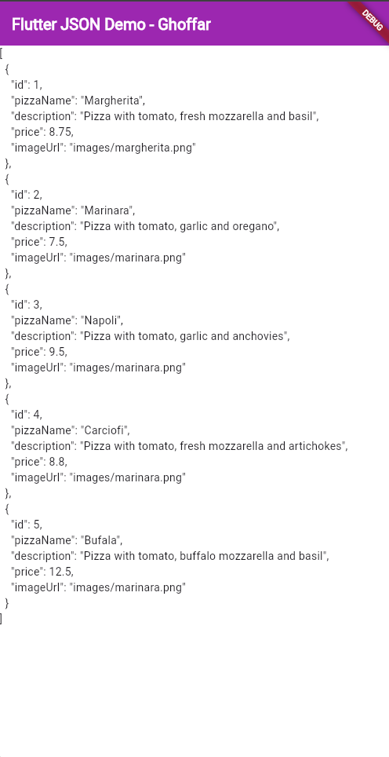

<p align="center"><strong>LAPORAN PRAKTIKUM MOBILE WEEK 13</strong></p>

<br><br>

<p align="center">
    
</p>

<div align="center">
  <table>
      <tr>
          <td><strong>Nama</strong></td>
          <td>: Ghoffar Abdul Ja'far</td>
      </tr>
      <tr>
          <td><strong>No Absen</strong></td>
          <td>: 16</td>
      </tr>
      <tr>
          <td><strong>NIM</strong></td>
          <td>: 2341720035</td>
      </tr>
      <tr>
          <td><strong>Prodi</strong></td>
          <td>: TEKNIK INFORMATIKA</td>
      </tr>
      <tr>
          <td><strong>Kelas</strong></td>
          <td>: 3H</td>
      </tr>
  </table>
</div>

# Tugas
## Soal 1
**Tambahkan nama panggilan Anda pada title app sebagai identitas hasil pekerjaan Anda.**
```
@override
  Widget build(BuildContext context) {
    return MaterialApp(
      title: 'Flutter JSON Demo - Ghoffar',
      theme: ThemeData(
        colorScheme: ColorScheme.fromSeed(seedColor: Colors.deepPurple),
      ),
      home: const MyHomePage(),
    );
  }
```
**Gantilah warna tema aplikasi sesuai kesukaan Anda.**
```
@override
  Widget build(BuildContext context) {
    return MaterialApp(
      title: 'Flutter JSON Demo - Ghoffar',
      theme: ThemeData(
        primarySwatch: Colors.purple,
      ),
      home: const MyHomePage(),
    );
  }
```
## Soal 2
**Hasil**


## Soal 3


## Soal 4

## Soal 5

## Soal 6


## Soal 7


## Soal 8


## Soal 9
